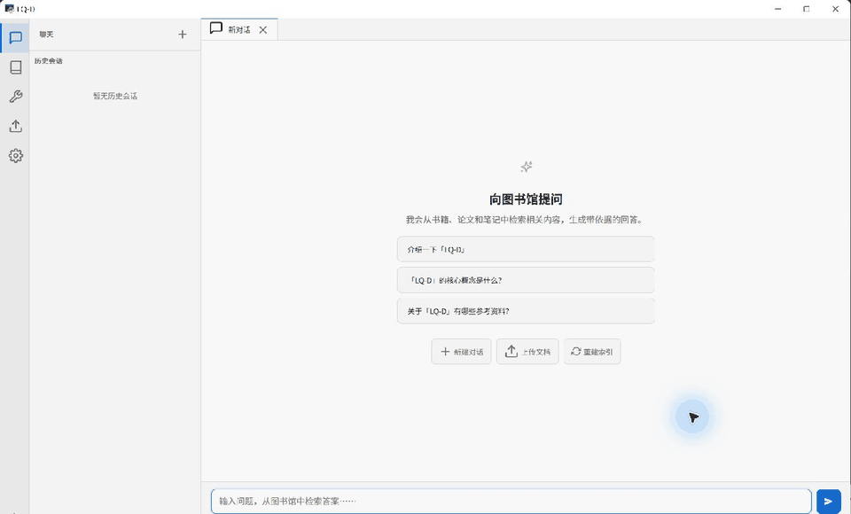
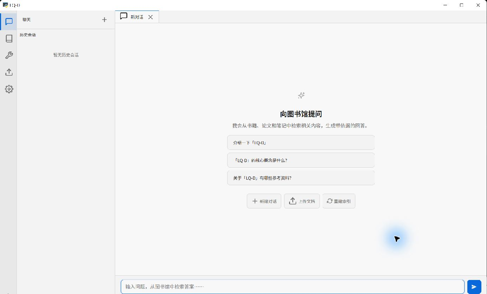
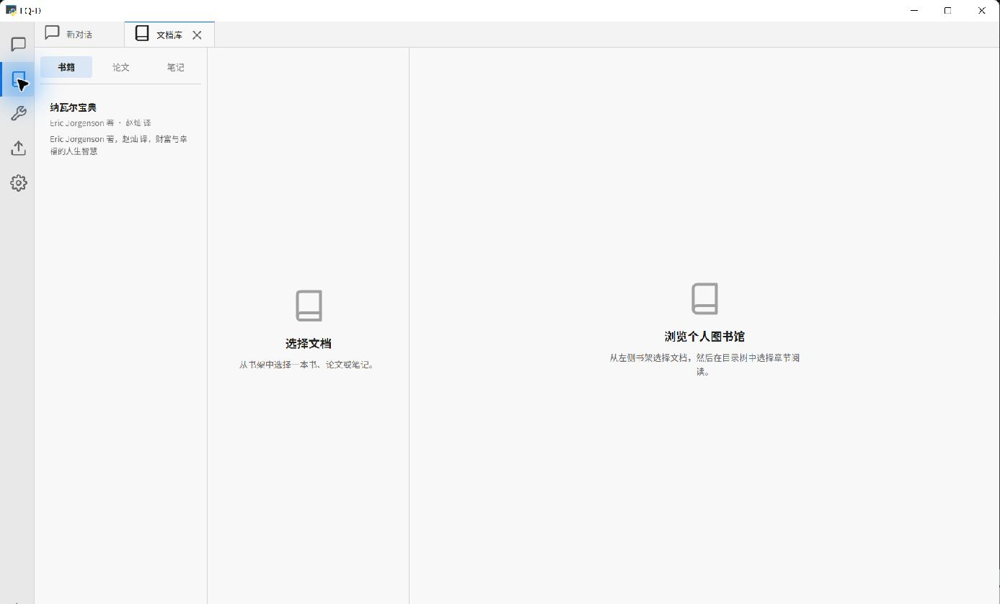
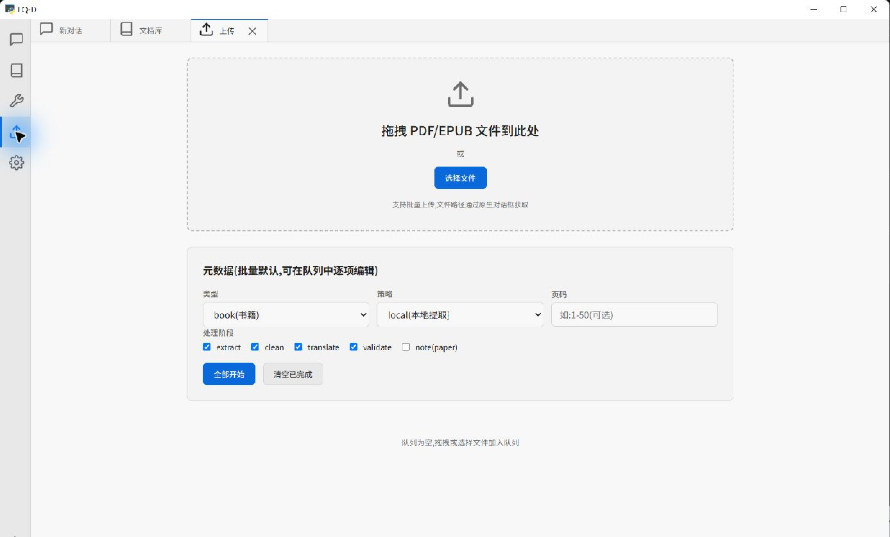
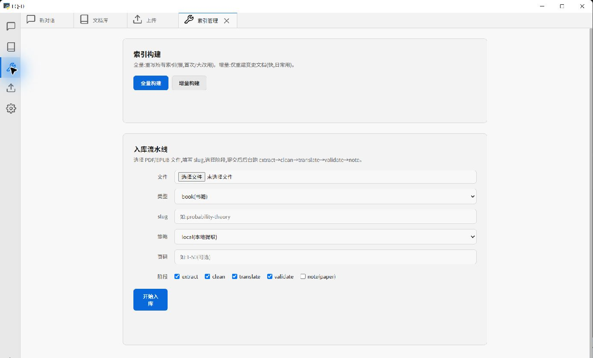

# LQ-D · 轻量个人知识库桌面端

<p align="center">
  <strong>把 PDF / EPUB 变成可阅读、可检索、可追溯引用的本地知识库。</strong><br>
  无数据库、无需前端构建工具，桌面窗口内完成导入、索引、阅读与 AI 问答。
</p>

<p align="center">
  <a href="https://github.com/guiguihui/lite-personal-library/releases/latest">下载最新版</a>
  · <a href="docs/architecture.md">技术架构</a>
  · <a href="docs/development.md">开发说明</a>
</p>



> GIF 会依次展示聊天首页、文档库、上传和索引管理。需要更清晰的版本，可[查看 MP4 演示](docs/assets/demo/lq-d-demo.mp4)。

## 为什么是 LQ-D

- **本地优先**：Markdown、索引和配置都保存在本地 `data/`，不依赖数据库或远程业务后端。
- **非常轻量**：前端是原生 HTML/CSS/JavaScript；Python 进程同时承载 PyWebView 桌面窗口和仅监听 `127.0.0.1` 的 FastAPI 服务。
- **一套检索链路**：搜索、聊天、文档库和知识链接统一使用 PageIndex V3，检索策略只维护一份。
- **可追溯回答**：聊天 Agent 从个人资料库检索上下文，回答可关联到原文位置。
- **自带模型配置**：支持 BYOK；API Key 优先保存在系统 Keyring，可选择前端直连或本地代理。
- **可重建数据**：Markdown 是事实源，索引是派生数据；索引损坏时可以重新构建。

## 界面一览

| 聊天与检索 | 文档库 |
|---|---|
|  |  |

| 文档上传 | 索引管理 |
|---|---|
|  |  |

## 5 分钟开始使用

### 环境要求

- Windows 10/11（当前已验证平台）
- Python 3.10 或更高版本
- WebView2 Runtime（Windows 10/11 通常已安装）
- EPUB 推荐安装 [Pandoc](https://pandoc.org/installing.html)；未安装时会尝试本地降级提取

### 1. 获取并安装

```powershell
git clone https://github.com/guiguihui/lite-personal-library.git
cd lite-personal-library
python -m pip install -e .
```

也可以从 [Releases](https://github.com/guiguihui/lite-personal-library/releases) 获取发布版本。

### 2. 启动桌面端

```powershell
python -m app.main
```

启动后会出现名为 **LQ-D** 的桌面窗口。应用内部的本地服务默认运行在 `http://127.0.0.1:8765`；通常不需要手动打开浏览器。

### 3. 完成首次配置

1. 打开左侧 **配置**，选择 LLM Provider 和模型，填写自己的 API Key。
2. 打开 **上传**，拖入或选择 PDF/EPUB；首次尝试建议只勾选 `extract`、`clean`、`validate`。
3. 等待导入完成，再到 **索引管理** 执行一次 **全量构建**。
4. 状态栏显示“索引就绪”后，可在 **文档库** 阅读，或回到 **聊天** 提问。

以后新增少量资料时使用 **增量构建** 即可。

## 导入格式与处理阶段

| 格式 | 当前状态 | 说明 |
|---|---|---|
| PDF | 支持 | 本地使用 PyMuPDF / pdfplumber；也可按配置选择 MinerU |
| EPUB | 支持 | 推荐 Pandoc；不可用时尝试 PyMuPDF 降级提取 |
| DOCX | 暂不开放 | 项目尚未提供经过验证的 DOCX 提取器 |

入库流水线按需执行：

```text
extract → clean → translate → validate → note
```

- `extract`：提取正文并转为 Markdown。
- `clean`：清理版面噪声；离线策略不会调用 LLM。
- `translate`：需要已配置的 LLM 与网络访问。
- `validate`：检查输出是否满足入库条件。
- `note`：面向论文生成笔记，同样需要 LLM。

如果只想验证本地导入，先关闭 `translate` 和 `note`，可以减少外部依赖和排错变量。

## 技术架构

```text
PyWebView / WebView2 桌面窗口
            │
            ▼
原生 Web 前端（Agent 编排、上下文、引用、界面）
            │ HTTP / 127.0.0.1:8765
            ▼
FastAPI 本地服务
├─ /api/search  ── PageIndex V3 唯一检索入口
├─ /api/index   ── V3 构建与原子发布
├─ /api/content ── 文档库读取
├─ /api/links   ── 知识链接与反向链接
├─ /api/ingest  ── PDF/EPUB 入库流水线
└─ /api/llm     ── 可选 LLM 代理
            │
            ▼
本地文件系统：data/content · data/pageindex · data/config · data/pdfs
```

LQ-D **不是没有后端**：后端和桌面端运行在同一台设备、同一个应用进程体系中。它的轻量来自“本地 loopback 服务 + 文件系统存储 + 无数据库”，而不是把所有工作塞进前端。详细边界、V3 Generation/View 和发布机制见[技术架构文档](docs/architecture.md)。

## 本地数据

```text
data/
├─ content/      # Markdown 事实源
├─ pageindex/    # PageIndex V3 与知识链接索引
├─ config/       # 应用和 Provider 配置
└─ pdfs/         # 已暂存的导入源文件
```

- `data/` 默认不提交到 Git，个人资料不会随源码推送。
- 本地检索不需要联网；只有你主动使用云端 LLM、MinerU 等 Provider 时才会产生外部请求。
- 备份时优先保存 `data/content/` 和 `data/config/`；`data/pageindex/` 可重新生成。

## 常见问题

### 启动后只看到浏览器或调试窗口

请从项目根目录运行 `python -m app.main`，不要单独启动前端静态页面。正常入口会创建 LQ-D 桌面窗口并在后台启动本地服务。

### 显示“知识库索引尚未生成”

导入完成不等于索引已发布。进入 **索引管理**，首次使用执行全量构建；后续使用增量构建。等待状态栏显示“索引就绪”后再搜索或聊天。

### EPUB 报 `input not found`

请通过应用的 **上传** 或原生文件选择器导入，不要只把文件手动复制到其他目录。应用会先把文件安全暂存到 `data/pdfs/`，再创建入库任务。

### EPUB 提取失败

先确认文件不是 DRM 加密或损坏，并检查 Pandoc 是否可用：

```powershell
pandoc --version
```

调试时只保留 `extract` 和 `validate`，避免翻译或笔记阶段掩盖真正的提取错误。

### LLM 请求返回 HTTP 500

检查 Provider、Base URL、模型名和 API Key；如果系统配置了 SOCKS 代理，确保已安装项目声明的 `httpx[socks]` 依赖。应用日志会给出具体失败阶段。

## 开发与验证

```powershell
# 安装开发依赖
python -m pip install -e ".[dev]"

# 运行测试
python -m pytest

# 启动应用
python -m app.main
```

前端不需要 npm 构建。更完整的目录说明、测试命令和运行边界见 [docs/development.md](docs/development.md)。

## 项目状态

当前版本：**v0.1.0**。核心桌面闭环、PDF/EPUB 入库、PageIndex V3、本地阅读、知识链接和 BYOK 聊天已具备；安装包、跨平台验证与更多文档格式仍在持续完善。

欢迎通过 [Issues](https://github.com/guiguihui/lite-personal-library/issues) 提交可复现的问题，或在 [Releases](https://github.com/guiguihui/lite-personal-library/releases) 查看版本说明。
