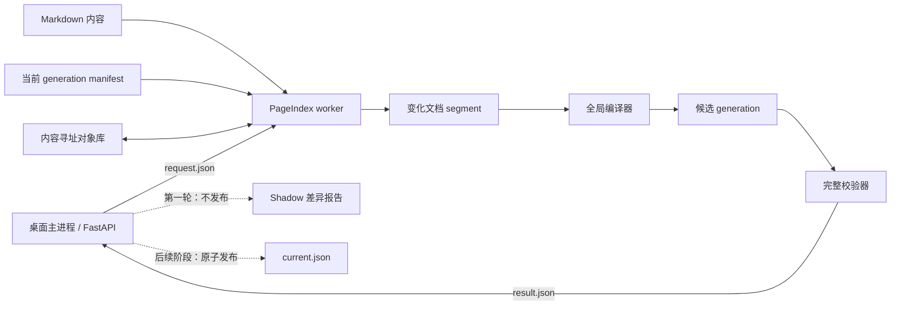

# PageIndex v2 增量索引技术规格

- 状态：Implemented — 阶段 A 已完成并实测；正式读取仍保持 legacy
- 日期：2026-07-29
- 受众：LQ-D 维护者、PageIndex/检索实现者、测试与发布负责人
- 主要模式：Technical Specification
- 第一轮交付：Shadow generation（不切换正式读取路径）

## 1. 概述

PageIndex v2 将当前“直接修改全局 JSON”的增量构建，改造成：

1. 以每文档不可变 segment 为事实来源；
2. 通过内容哈希复用未变化 segment；
3. 从全部 segment 确定性编译 generation；
4. 在独立 worker 进程中构建和校验；
5. 由桌面主进程原子发布；
6. 通过 shadow 模式验证后，再逐步替换旧读取路径。

增量构建是默认主路径。全量构建保留为用户可选的修复、迁移和重新验证手段。

## 2. 背景与问题

当前实现位于：

- `app/vendor/build_pageindex.py`
- `app/index/builder.py`
- `app/index/status.py`
- `frontend/chat/retrieval.js`

已确认的问题：

- 当前增量构建从已经过滤过的全局 postings 继续修改，增量结果与同内容的全量结果不等价。
- 全量构建直接写正式目录，不会清除已经删除文档留下的旧 JSON。
- 构建中途失败可能留下新旧混合索引。
- `/api/status` 只检查 `global-index.json` 是否存在，无法证明整套索引一致。
- 当前顺序 `node_id/chunk_id` 不适合作为跨 generation 的持久引用。
- LLM 摘要与索引构建耦合，可能导致全量构建重复产生网络费用。
- 当前前端索引加载不绑定 generation，一次加载可能跨越发布边界。

实测基线（2026-07-29，当前仓库样本）：

| 指标 | 数值 |
|---|---:|
| 文档 | 3 |
| 节点 | 203 |
| chunk | 420 |
| token | 21,339 |
| posting | 58,028 |
| 新构建索引 | 约 1.43 MiB |
| 全量构建 | 约 0.25 s |
| 前端索引初始化堆增量 | 约 13.6 MiB |
| 旧文档树残留 | 59 个，约 17.88 MiB |

现有 148 条 golden queries 与当前内容快照不匹配，仅约 9.6% 的可回答问题包含实际存在的期望文档，因此不能作为当前内容的绝对质量结论。

## 3. 目标

### 3.1 功能目标

- 增量构建只重新解析发生新增、修改或删除的文档。
- 增量和全量对同样内容与配方产生相同 generation ID。
- title、breadcrumb、body 使用独立字段统计。
- 构建失败不影响当前可用索引。
- 支持 `incremental`、`recompile`、`full` 三种内部模式。
- 支持 generation 回滚和启动恢复。
- 支持 legacy 索引平滑迁移。
- 保持现有前端全局 JSON 格式兼容，直至 generation 读取路径完成验证。

### 3.2 正确性目标

- 所有 segment 和 generation 均可内容寻址、确定性复现。
- 所有 posting 引用都能解析到存在的 chunk、node 和 document。
- 构建期间内容继续变化时，不发布混合快照。
- 构建、取消、崩溃和主进程退出均不能污染 current generation。

### 3.3 性能目标

标准容量：

- 1,000 个文档；
- 50,000 个 chunk。

压力容量：

- 100,000 个 chunk。

50,000 chunks 目标：

| 指标 | 目标 |
|---|---:|
| 单文档变化检测 | < 300 ms |
| 单文档 segment 重建（不含 LLM） | < 1 s |
| 全局合并 | < 3 s |
| 校验与发布 | < 1 s |
| 单文档增量总耗时 P95 | < 5 s |
| 删除一个文档 | < 5 s |
| 无变化检查 | < 500 ms |
| worker 峰值内存 | < 512 MiB |

100,000 chunks 压力目标：

- 增量总耗时 < 15 s；
- worker 峰值内存 < 1 GiB。

## 4. 非目标

第一轮不实现：

- 不切换正式 `/pageindex/*` 读取路径；
- 不写 `current.json`；
- 不修改前端索引加载和问答链路；
- 不移动或删除 legacy 索引；
- 不向普通用户暴露 PageIndex v2 开关；
- 不实现运行时分片检索；
- 不移除旧构建器；
- 不让检索质量指标阻断用户内容发布；
- 不引入数据库、消息队列、MessagePack 或自定义二进制格式。

## 5. 术语

| 术语 | 定义 |
|---|---|
| Document | 一本书、一篇论文或一则笔记 |
| Segment | 单个 Document 的规范化、未做全局 DF 裁剪的不可变索引对象 |
| Segment object | 以 segment 内容 SHA-256 命名的物理 JSON 文件 |
| Generation | 一组确定的 segment 引用及其全局编译产物 |
| Recipe | 会影响 segment 或全局编译结果的版本化参数集合 |
| Publisher | 唯一有权切换 `current.json` 的桌面主进程 |
| Worker | 短生命周期 PageIndex 构建子进程 |
| Legacy index | 当前平铺在 `pageindex/` 下的旧格式索引 |
| Shadow generation | 完整构建、校验、对比，但不发布的候选 generation |
| Dirty set | 构建期间等待处理的新增、修改、删除文档集合 |

## 6. 总体架构



职责边界：

- Worker 负责生成、编译、重型校验和结果报告。
- 主进程负责单写者调度、任务状态、轻量复核与最终发布。
- Worker 无权修改 `current.json`。
- 前端在后续阶段只读取明确 generation，不直接读取构建中目录。

## 7. 目录布局

目标布局：

```text
pageindex/
├── current.json
├── objects/
│   ├── segments/
│   │   └── ab/
│   │       └── abcdef....json
│   └── summaries/
│       └── ab/
│           └── abcdef....json
├── generations/
│   └── <generation-id>/
│       ├── manifest.json
│       ├── global-index.json
│       ├── node-index.json
│       ├── chunks.json
│       ├── inverted-index.json
│       ├── books/
│       ├── papers/
│       └── notes/
├── build/
│   └── <job-id>/
│       ├── request.json
│       ├── progress.json
│       ├── events.jsonl
│       ├── result.json
│       └── cancel.request
└── legacy/
    └── <migration-id>/
```

第一轮只创建：

- `objects/segments/`
- `objects/summaries/`（可先实现接口，摘要缓存可延后接入）
- `generations/<id>/`
- `build/<job-id>/`

第一轮不创建或修改 `current.json`。

## 8. Segment 设计

### 8.1 事实来源

Segment 是单文档索引的唯一事实来源，保存：

- 文档元数据；
- 节点；
- chunk；
- 字段长度；
- 未做全局 DF 裁剪的字段级 postings；
- 源文件内容指纹；
- segment recipe 指纹。

不得从旧全局索引反推 segment。

### 8.2 示例 schema

```json
{
  "schema_version": 2,
  "document": {
    "doc_key": "book:naval-almanack",
    "id": "naval-almanack",
    "type": "book",
    "title": "纳瓦尔宝典",
    "author": "",
    "tags": []
  },
  "fingerprint": {
    "content_hash": "sha256:...",
    "recipe_hash": "sha256:...",
    "source_files": [
      {
        "path": "books/naval-almanack/ch01.md",
        "sha256": "..."
      }
    ]
  },
  "nodes": [
    {
      "node_key": "n_83d0a7c912...",
      "legacy_node_id": "0012",
      "title": "如何创造财富",
      "breadcrumb": ["纳瓦尔宝典", "财富"],
      "source_md": "content/books/naval-almanack/ch01.md",
      "line_num": 120,
      "line_end": 146,
      "summary": "..."
    }
  ],
  "chunks": [
    {
      "local_id": 0,
      "node_key": "n_83d0a7c912...",
      "title": "如何创造财富",
      "breadcrumb": ["纳瓦尔宝典", "财富"],
      "body": "...",
      "source_md": "content/books/naval-almanack/ch01.md",
      "line_num": 120,
      "lengths": {
        "title": 4,
        "breadcrumb": 11,
        "body": 387
      }
    }
  ],
  "postings": {
    "财富": [
      [0, 1, 1, 6]
    ]
  }
}
```

Posting 数组：

```text
[local_chunk_id, title_tf, breadcrumb_tf, body_tf]
```

### 8.3 序列化

Segment 使用确定性紧凑 UTF-8 JSON：

```python
json.dumps(
    segment,
    ensure_ascii=False,
    sort_keys=True,
    separators=(",", ":"),
)
```

约束：

- UTF-8，无 BOM；
- key 排序；
- 无缩进；
- TF 和长度均为整数；
- 数组顺序必须确定；
- 缺失字段和空字段规则必须版本化；
- 同一输入跨平台产生同一字节与 SHA-256。

物理路径：

```text
objects/segments/<hash-prefix>/<full-hash>.json
```

对象一旦写入便不可修改。

## 9. 标识设计

### 9.1 文档

```text
doc_key = "<doc_type>:<slug>"
```

### 9.2 节点

```text
node_key = short_sha256(
    doc_key
    + normalized_relative_source_path
    + normalized_heading_path
    + duplicate_heading_ordinal
)
```

性质：

- 在前面插入无关章节，不改变其他节点的 `node_key`；
- 修改正文但不改标题层级时保持稳定；
- 重命名或移动章节时视为新节点；
- 同路径同名标题使用重复序号消歧。

### 9.3 Chunk

Segment 内使用 `local_id`。

当前兼容全局导出按以下顺序确定性分配数字 chunk ID：

```text
doc_key → node_key → local_id
```

全局数字 ID 只在单个 generation 内有效，不作为持久引用。

## 10. 指纹与失效

### 10.1 内容指纹

`content_hash` 包含：

- 文档内所有 Markdown 相对路径；
- 每个 Markdown 文件完整内容；
- `_index.md` front matter；
- 章节顺序和 weight。

不包含：

- 绝对路径；
- 默认不参与检索的图片二进制；
- 文件系统创建时间。

### 10.2 Segment recipe

影响 segment 的参数：

- segment schema 版本；
- tokenizer 版本；
- chunk 大小与 overlap；
- Markdown/front matter 解析规则；
- heading/node 切分规则；
-摘要策略；
-摘要模型标识；
-摘要 prompt 版本。

### 10.3 Global compiler recipe

影响 generation 全局产物的参数：

-全局 schema 版本；
-字段权重格式；
- body 高频裁剪阈值；
-兼容导出格式版本；
-全局排序和 ID 分配规则。

### 10.4 失效矩阵

| 变化 | 处理 |
|---|---|
| 单文档内容变化 | 只重建该文档 segment |
| 新增文档 | 新建 segment |
| 删除文档 | 新 manifest 不引用该 segment |
| body 裁剪阈值变化 | 复用 segment，执行 recompile |
|全局导出格式变化 | 复用 segment，执行 recompile |
| tokenizer 变化 | full |
| chunk 参数变化 | full |
|节点切分规则变化 | full |
|摘要模型或 prompt 变化 |重建相关 segment |
| UI/CSS 变化 |不重建 |
|内容绝对目录变化 |不重建 |

mtime 和文件大小只用于避免重复计算哈希，最终复用决策以内容哈希为准。

## 11. 字段级 DF 策略

确定策略：

```text
title postings        永不按 DF 删除
breadcrumb postings   永不按 DF 删除
body postings         只删除极端高频 token
```

Body posting 仅在两个条件同时满足时裁剪：

```text
body_chunk_df >= 256
body_chunk_df / total_chunks >= 0.90
```

规则：

- 只将目标 token 的 `body_tf` 清零或从 body posting 视图移除；
- title 和 breadcrumb TF 必须保留；
- segment 原始 posting 永不删除；
-阈值变化只需要 recompile；
-支持内部领域词白名单；
-第一版不向普通用户暴露阈值。

Manifest 记录：

-裁剪前 token/posting 数；
-裁剪后 token/posting 数；
-被裁剪 body token 数；
-估算节省字节。

## 12. Generation 设计

### 12.1 确定性 ID

Generation 核心 manifest：

```json
{
  "schema_version": 2,
  "compiler_recipe_hash": "sha256:...",
  "documents": {
    "book:naval-almanack": "sha256:segment-a",
    "note:welcome": "sha256:segment-b"
  }
}
```

计算：

```text
revision_hash = SHA-256(canonical_json(core_manifest))
generation_id = revision_hash 前 20 个十六进制字符
```

同内容、同 recipe 的 incremental、recompile 和 full 必须产生相同 generation ID。

发布时间、任务 ID、耗时和 warning 不参与 generation ID。

### 12.2 Manifest

Generation manifest 至少包含：

```json
{
  "schema_version": 2,
  "generation": "...",
  "revision_sha256": "...",
  "compiler_recipe_hash": "...",
  "documents": {},
  "files": {
    "global-index.json": {
      "sha256": "...",
      "bytes": 0
    }
  },
  "stats": {
    "documents": 0,
    "nodes": 0,
    "chunks": 0,
    "tokens": 0,
    "postings": 0
  },
  "pruning": {},
  "warnings": []
}
```

### 12.3 发布指针（后续阶段）

```json
{
  "generation": "...",
  "manifest_sha256": "...",
  "previous_generation": "...",
  "published_at": "...",
  "job_id": "..."
}
```

主进程通过：

```text
write current.json.tmp
→ flush
→ fsync
→ os.replace
```

完成原子切换。

## 13. 构建模式

### 13.1 incremental

- 检测内容变化；
- 只重建 dirty documents；
-复用其余 segment objects；
-重新编译全局产物；
-完整校验；
-后续阶段由主进程发布。

### 13.2 recompile

-复用所有 segment；
-重新执行全局合并、字段裁剪、兼容导出和校验；
-不重新解析 Markdown；
-不调用 LLM。

### 13.3 full

-忽略已有 segment 复用决策；
-重新解析全部源文档；
-默认仍可复用内容寻址摘要缓存；
-重新生成全部 segment；
-编译并校验 generation。

普通 UI 后续只突出：

- 更新索引（incremental）
- 完全重建（full）

`recompile` 是内部和高级模式。

## 14. 构建状态机与并发

单写者状态机：

```text
idle
→ detecting_changes
→ building_segments
→ compiling_global
→ validating
→ ready_to_publish
→ publishing
→ idle
```

规则：

- 同一时间最多一个 PageIndex 写任务；
-新变化合并进入 dirty set；
-构建结束前重新检查内容指纹；
-最多进行 3 轮稳定化；
-持续变化时可产出内部一致但 stale 的候选，并立即排队下一次增量；
-full 请求可将正在运行的 incremental 标记为 superseded；
-不强杀线程/进程，在安全阶段协作式取消；
-publishing 已开始时允许原子发布完成，再执行排队任务。

## 15. Worker 进程

Worker 使用现有应用可执行文件的特殊入口：

```text
lq-d.exe --pageindex-worker <request.json>
```

开发模式可使用：

```text
python -m app.pageindex_worker <request.json>
```

任务目录：

```text
build/<job-id>/
├── request.json
├── progress.json
├── events.jsonl
├── result.json
└── cancel.request
```

Worker 职责：

-读取 request；
-处理 segment objects；
-生成候选 generation；
-执行完整校验；
-写 result；
-退出并释放内存。

主进程职责：

-单写者调度；
-启动 worker；
-读取进度；
-处理取消/superseded；
-校验 worker 退出码；
-轻量复核 generation 与 manifest hash；
-作为唯一 publisher。

结果示例：

```json
{
  "status": "ready_to_publish",
  "job_id": "...",
  "base_generation": "...",
  "generation": "...",
  "manifest_sha256": "...",
  "warnings": [],
  "stats": {
    "segments_rebuilt": 2,
    "segments_reused": 998,
    "chunks": 50000
  }
}
```

## 16. 校验与发布门槛

以下属于结构硬错误，后续阶段必须拒绝发布：

1. schema 或 recipe 版本不可识别；
2. manifest 所列文件缺失；
3. segment hash 不匹配；
4. global document 集合与 segment 集合不一致；
5. node 引用未知 document；
6. chunk ID 重复；
7. posting 引用未知 chunk；
8. chunk 引用未知 node/document；
9. title/breadcrumb posting 被 DF 裁剪；
10. body 裁剪不符合 `256 + 90%`；
11. JSON 无法解析；
12.文件 hash 或大小不匹配。

以下只产生 warning，不阻断：

- Recall/MRR 下降；
-标题或正文冒烟查询无结果；
-搜索延迟回归；
-索引体积增长；
-单文档 chunk 数异常；
-摘要为空或使用 fallback；
-裁剪节省空间不明显。

## 17. LLM 摘要缓存

摘要是可选增强，不属于索引正确性的硬依赖。

缓存键：

```text
SHA-256(
  normalized_node_text
  + model_id
  + prompt_version
  + summary_policy_version
)
```

规则：

-未配置 LLM 时使用确定性截断；
-缓存命中时复用；
-缓存未命中时调用 LLM；
-超时或失败时 fallback 并产生 warning；
-LLM 失败不阻止 generation；
-fallback 不伪装成成功 LLM 缓存；
-incremental 只处理变化节点；
-recompile 不调用 LLM；
-full 默认复用缓存；
-只有“刷新 AI 摘要”显式操作忽略缓存。

## 18. Generation 绑定与前端一致性（后续阶段）

状态接口后续增加：

```json
{
  "index_ready": true,
  "index_generation": "...",
  "index_schema_version": 2,
  "index_stale": false
}
```

新版前端使用：

```text
/pageindex/g/<generation>/global-index.json
/pageindex/g/<generation>/node-index.json
/pageindex/g/<generation>/chunks.json
/pageindex/g/<generation>/inverted-index.json
/pageindex/g/<generation>/<type>/<slug>.json
```

规则：

-一次加载和一次问答固定使用同一个 generation；
-正在生成的回答不中途切换；
-发布完成后发送 `index:published`；
-下一次搜索或提问切换；
-旧 generation 保留期间旧请求继续有效；
-旧无版本路径继续解析到 current，供 legacy 前端兼容。

## 19. 历史引用

持久引用保存：

```json
{
  "generation": "...",
  "doc_key": "book:naval-almanack",
  "node_key": "n_83d0a7c912...",
  "snapshot": {
    "document_title": "...",
    "section_title": "...",
    "breadcrumb": [],
    "excerpt": "...",
    "source_md": "...",
    "line_num": 0,
    "line_end": 0
  }
}
```

解析顺序：

1. 原 generation 存在时打开原节点；
2. 否则映射当前 generation 的相同 `doc_key + node_key`；
3. 无法映射时展示保存的最小引用快照。

历史快照只保存实际送入 LLM 的引用片段，不保存整篇文档。

## 20. Legacy 迁移（后续阶段）

首次发现无 `current.json` 但存在旧全局索引时：

-标记 `legacy`；
-继续使用旧索引；
-不从旧索引推导 segment；
-第一次更新执行源 Markdown bootstrap；
-bootstrap 成功前不改变正式读取；
-首个新 generation 成功后再进入实验性 generation 模式；
-至少第二个 generation 成功后才允许归档 legacy；
-bootstrap 失败时继续使用 legacy。

## 21. 启动恢复（后续阶段）

启动时快速验证 current：

-指针格式；
-manifest hash；
-必需文件存在；
-文件 hash 与大小。

Current 损坏时：

1. 自动验证 previous；
2. previous 可用则以 degraded 状态启动；
3.通知用户；
4.排队增量修复；
5.连续失败时停止自动重试。

Current 和 previous 都不可用时：

-有 legacy 则只读使用 legacy；
-无 legacy 则 `index_ready=false`；
-Library 可继续直接读取 Markdown；
-AI 检索暂不可用；
-提示用户更新或完全重建。

## 22. 保留与 GC

默认：

-保留 current；
-保留 previous；
-保留用户显式固定的 generation；
-未引用 segment object 延迟 24 小时后可清理；
-失败构建目录保留 24 小时；
-摘要缓存最大 1 GiB，使用 LRU，优先保留近 90 天访问对象。

GC：

-不与构建/发布并行；
-只在空闲期运行；
-先标记引用，再执行清除；
-删除前重新读取 current；
-失败只产生 warning；
-目录超过 2 GiB 或启动后延迟检查时触发；
-提供可回收空间预览。

## 23. 质量与性能报告

检索质量和性能不阻断用户发布。

每次构建报告：

-文档/节点/chunk/token/posting 数；
-segment rebuilt/reused/deleted；
-每阶段耗时；
-峰值内存；
-索引体积；
-body 裁剪统计；
-摘要命中/请求/fallback；
-标题、章节、正文抽样查询结果；
-与上一 generation 的变化。

现有 golden 评测必须：

-先验证期望文档存在；
-缺失语料标记 `skipped_missing_corpus`；
-不把缺失语料计入 Recall/MRR 分母；
-报告语料覆盖率。

固定 fixture corpus 下，CI 可对算法回归设门槛；用户正常内容更新不受其阻断。

## 24. Shadow 差异报告

第一轮同时读取 legacy 与 v2 shadow generation，输出：

```text
文档集合差异
节点集合差异
规范化 chunk 集合差异
字段 posting 差异
随机查询 Top-K 差异
索引体积差异
构建耗时与峰值内存差异
```

差异必须可定位到：

- `doc_key`
- `node_key`
- token
-字段
- legacy/v2 两侧值

Shadow 差异只报告，不改变 legacy 服务路径。

## 25. 测试计划

### 25.1 单元测试

-规范化 JSON 跨运行确定；
- segment hash 确定；
- generation ID 确定；
- content/recipe 失效矩阵；
-稳定 node_key；
-字段 TF 正确；
- title/breadcrumb 不裁剪；
- body 双阈值裁剪；
- manifest/file hash 校验；
-对象重复写入复用；
-取消和 superseded 状态转换。

### 25.2 集成测试

-新增、修改、删除单文档；
-同内容 incremental/full generation ID 相同；
- recompile 复用 segment；
- worker 异常退出；
-损坏 segment；
-损坏 posting 引用；
-主进程在 worker 完成后、发布前退出；
-构建期间内容继续变化；
-连续三轮 dirty set；
-Windows 打包 worker 入口。

### 25.3 属性与故障注入

-连续 100 次随机增删改；
-每轮增量与 full 语义等价；
-随机阶段终止 worker；
-随机破坏候选 generation 文件；
-确保 legacy/current 不被污染；
-重复执行相同请求保持幂等。

### 25.4 容量测试

- 1,000 documents / 50,000 chunks；
- 100,000 chunks 压力测试；
-记录 P50/P95、CPU、内存和磁盘；
-超过标准容量目标时评估运行时分片阶段。

## 26. 分阶段实施

### 阶段 A：Shadow generation（第一轮）

实现：

1. v2 schema 和类型；
2. canonical serializer/hash；
3. content/recipe fingerprint；
4. stable doc/node IDs；
5.字段级 segment builder；
6.内容寻址 segment store；
7. deterministic global compiler；
8. validation；
9. worker/task protocol；
10. shadow generation；
11. legacy/v2 diff report；
12.等价性与容量测试工具。

不实现正式发布和读取切换。

### 阶段 B：Shadow 连续验证

-旧索引继续服务；
-新版随旧构建可选运行；
-收集连续构建数据；
-修复所有结构差异；
-质量差异只报告。

### 阶段 C：实验性 generation

-主进程 publisher；
- current/previous；
- generation HTTP 路由；
-前端 generation pin；
-启动恢复；
-legacy bootstrap；
-高级设置开关。

### 阶段 D：默认 generation

进入条件：

-连续 100 次增量无结构错误；
-incremental/full generation ID 100% 一致；
-worker 故障恢复通过；
-Windows 打包测试通过；
-50,000 chunks 达标；
-回滚与 legacy fallback 通过。

至少保留一个发布周期的 legacy 兼容。

## 27. 第一轮 Definition of Done

第一轮完成必须同时满足：

- shadow generation 可从当前内容完整构建；
-不修改正式 legacy 读取路径；
-相同输入产生相同 segment/generation hash；
-单文档 incremental 与 full 产生相同 generation ID；
- title/breadcrumb postings 从不按 DF 删除；
- body 仅按 `>=256 && >=90%` 裁剪；
- worker 失败不影响旧索引；
- shadow 报告可以解释所有关键差异；
-现有测试继续通过；
-新增确定性、增删改、取消、损坏与恢复测试；
-容量基准可重复运行；
-没有未记录的数据迁移或删除。

## 28. 风险与缓解

| 风险 | 缓解 |
|---|---|
| 新旧算法产生大量合理差异 | Shadow 报告按字段和 token 解释，不直接切流量 |
| Segment JSON 体积增大 | 内容寻址复用；达到实测阈值后再考虑压缩 |
| 全局合并成为增量瓶颈 | 50k 容量门槛；超标后启动运行时分片设计 |
| Worker 打包复杂 | 使用同一 EXE 特殊入口；增加打包集成测试 |
| 内容持续变化导致饥饿 | dirty set 合并、最多三轮稳定化、排队后续任务 |
| 摘要网络失败 |确定性 fallback，不阻断 generation |
| 对象库增长 | current/previous 引用、24h 延迟 GC、1 GiB 摘要 LRU |
| 历史引用失效 |稳定 node_key + 最小引用快照 |
| Legacy 迁移失败 |成功前继续 legacy，延迟归档 |

## 29. 回滚原则

第一轮没有正式切换，因此回滚等同于禁用 shadow worker，不影响用户。

后续正式阶段：

- publisher 将 `current.json` 指回 previous；
-不修改 generation 内容；
-不从损坏 generation 拼接文件；
- generation 读取失败时自动回退；
- legacy 保留至少一个发布周期；
-回滚不删除 segment objects，GC 延迟处理。

## 30. 已确认决策

截至 2026-07-29，以下决策已确认：

-增量优先，全量为用户可选项；
-每文档 segment 是事实来源；
-第一阶段保持现有单体运行时格式兼容；
- generation 版本化并使用原子 pointer；
-内容哈希与 recipe hash 决定失效；
- segment 保存字段级 TF、长度和未过滤 postings；
- title/breadcrumb 不按 DF 删除；
- body 只按 `256 + 90%` 裁剪；
-结构错误阻断，质量与性能不阻断；
-单写者和 dirty set；
-内部三种构建模式；
-摘要失败可降级并使用缓存；
-legacy 从源内容 bootstrap；
-前端和问答绑定 generation；
-segment 使用内容寻址对象库；
- segment 使用规范化 JSON；
- generation 使用内容确定性 ID；
-文档/节点 ID 稳定，chunk ID 只在 generation 内紧凑；
-历史引用保存最小快照；
-保留 current/previous，延迟 GC；
-启动损坏自动回退 previous；
-使用独立 worker；
-主进程是唯一 publisher；
-采用 shadow 分阶段上线；
-第一轮止于 shadow generation。

## 31. 阶段 A 实施状态（2026-07-29）

阶段 A 已实现并在仓库真实语料上完成 full、incremental、recompile 与 Shadow 对比。实现边界仍然是不创建、不修改 `current.json`，不切换现有 HTTP 和前端读取路径。

### 31.1 已实现模块

核心包位于 `app/index/v2/`：

- `canonical.py`：规范 JSON、SHA-256 与原子文件替换；
- `ids.py`：稳定 `doc_key`、`node_key` 与跨平台相对路径；
- `catalog.py`：文档发现、完整输入集合与内容指纹；
- `segment_builder.py`：不可变源快照、字段 TF/长度和未裁剪 Segment；
- `object_store.py`：内容寻址 Segment 存储、验证与损坏对象修复；
- `compiler.py`：确定性全局合并、分字段裁剪与 legacy 兼容导出；
- `validator.py`：manifest、文件、引用、recipe、指纹和字段 posting 重算校验；
- `protocol.py`、`worker.py`、`supervisor.py`：任务文件协议、短生命周期 Worker 和主进程轻量复核；
- `shadow_diff.py`：legacy/v2 语义归一化与字段级策略差异报告；
- `benchmark.py`：可重复真实/合成语料容量基准。

入口位于：

- 开发模式：`python -m app.pageindex_worker <request.json>`；
- 打包模式：`lq-d.exe --pageindex-worker <request.json>`；
- Shadow 编排：`python -m app.index.v2.supervisor ...`。

Worker 只写：

```text
data/pageindex/objects/segments/
data/pageindex/generations/
data/pageindex/build/
```

每个完成任务在 `build/<job-id>/shadow-report.json` 保存完整差异，`result.json` 只保存汇总和相对报告路径。

### 31.2 最终标识与归一化规则

`node_key` 的最终格式为：

```text
n_ + canonical SHA-256 的前 24 个小写十六进制字符
```

哈希输入为 `doc_key + 规范 source_path + 规范 breadcrumb + duplicate_ordinal`。Generation ID 仍为 revision SHA-256 的前 20 个十六进制字符；数字 chunk ID 只在单个 Generation 内有效。

Shadow 对比采用：

- 文档：`type:id`；
- 节点：`doc_key + node_key`，由 Generation manifest 引用的 Segment 映射 legacy node ID；
- chunk：`doc_key + node_key + 节点局部序号`，body SHA-256 仅作诊断；
- posting：`token + 语义 chunk key`，并依据 Segment 字段事实和 manifest 中的实际 compiler recipe 独立复核；
- 文档树：只比较 `global-index.json` 当前引用的树，legacy 遗留树单独计数。

报告明确区分 `structural_ok`、`semantic_equal`、`expected_policy_delta`、`unexplained_semantic_mismatch` 和 `publish_blocking_errors`。Legacy 的 35% document-DF 全字段裁剪与 v2 新字段策略之间的合理恢复被标为 `expected_legacy_df_policy_delta`，不会被误当作结构故障。

### 31.3 Worker 退出码与信任边界

| 退出码 | 含义 |
|---:|---|
| `0` | Generation、结构校验和可用 Shadow 对比通过 |
| `1` | 构建、校验或 Shadow 结构对比失败 |
| `2` | request/schema/path/mode 无效 |
| `3` | 在安全阶段观察到协作式取消 |

Supervisor 在接受成功结果前复核 request 身份、20-hex Generation ID、Generation 目录边界、canonical manifest、manifest 内 ID 和 manifest SHA-256。Incremental 默认绑定最新有效 Shadow Generation，只从该基线引用的 Segment 建立复用表；首次没有 Generation 时才扫描对象库 bootstrap。

### 31.4 运行命令

```powershell
python -m app.index.v2.supervisor full --content data/content --pageindex data/pageindex
python -m app.index.v2.supervisor incremental --content data/content --pageindex data/pageindex
python -m app.index.v2.supervisor recompile --content data/content --pageindex data/pageindex
```

可重复容量基准：

```powershell
python -m app.index.v2.benchmark --content E:\benchmark\content --pageindex E:\benchmark\pageindex --full-runs 3 --incremental-runs 10 --synthetic-documents 1000 --synthetic-sections 50 --synthetic-words 128 --synthetic-vocabulary 4096 --synthetic-seed 42 --output E:\benchmark\result.json
```

基准会校验 legacy core、`.fingerprints.json`、`current.json` 和树文件在运行前后字节不变。大规模测试目标仍是 1,000 documents / 50,000 chunks；本轮只完成工具和小型回归，没有宣称已达到 50k 性能门槛。

Python 分配峰值追踪默认关闭，以免 `tracemalloc` 扭曲耗时；需要该指标时显式增加 `--trace-memory`。报告会把该指标标记为 `measured` 或 `disabled`，避免把空值误认为零内存。

### 31.5 真实语料验证结果

当前仓库语料的 full、incremental 和 recompile 均产生：

```text
generation = 3045721805f056f8a042
documents  = 3
nodes      = 203
chunks     = 420
tokens     = 22,099
postings   = 67,713
```

- full：重建 3 个 Segment；
- incremental：基线明确，复用 3 个、重建 0 个；
- recompile：复用 3 个、重新编译全局产物；
- 67 个 legacy 运行时/指纹 JSON 文件保持字节不变；
- 文档、节点、chunk 和文档树的未解释语义差异为 0；
- 9,685 条 posting 变化全部归因于预期策略变化；
- `structural_ok=true`、`unexplained_semantic_mismatch=0`、`publish_blocking_errors=0`；
- 单独识别 59 个 stale legacy 树文件，共 18,747,698 bytes。
- PageIndex v2 专项测试 87 项通过；仓库完整回归 339 项通过、1 项跳过。

### 31.6 后续阶段保留项

以下内容没有混入阶段 A：

- `current.json` / previous publisher；
- Generation HTTP 路由和前端 Generation pin；
- 与 legacy 构建自动并跑的 coordinator、单写者 dirty set 和 supersede 调度；
- 启动恢复、legacy migration、历史引用映射；
- 摘要对象缓存、保留策略和 GC；
- 正式读取路径切换。

这些项目分别进入阶段 B/C；在此之前，现有 legacy 服务路径仍是唯一正式读取路径。
